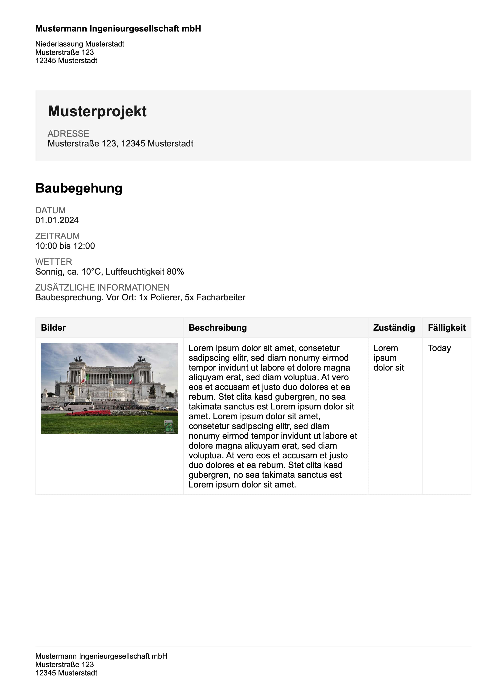

# PDF Report Generation 

A tool to generate professionally looking PDFs (see `output/report.pdf` for an example) with footers and headers like:



## Development

Setup virtual environment:

```
poetry shell
poetry install
```

Execute `development.ipynb` notebook, which generates a report using example data.

